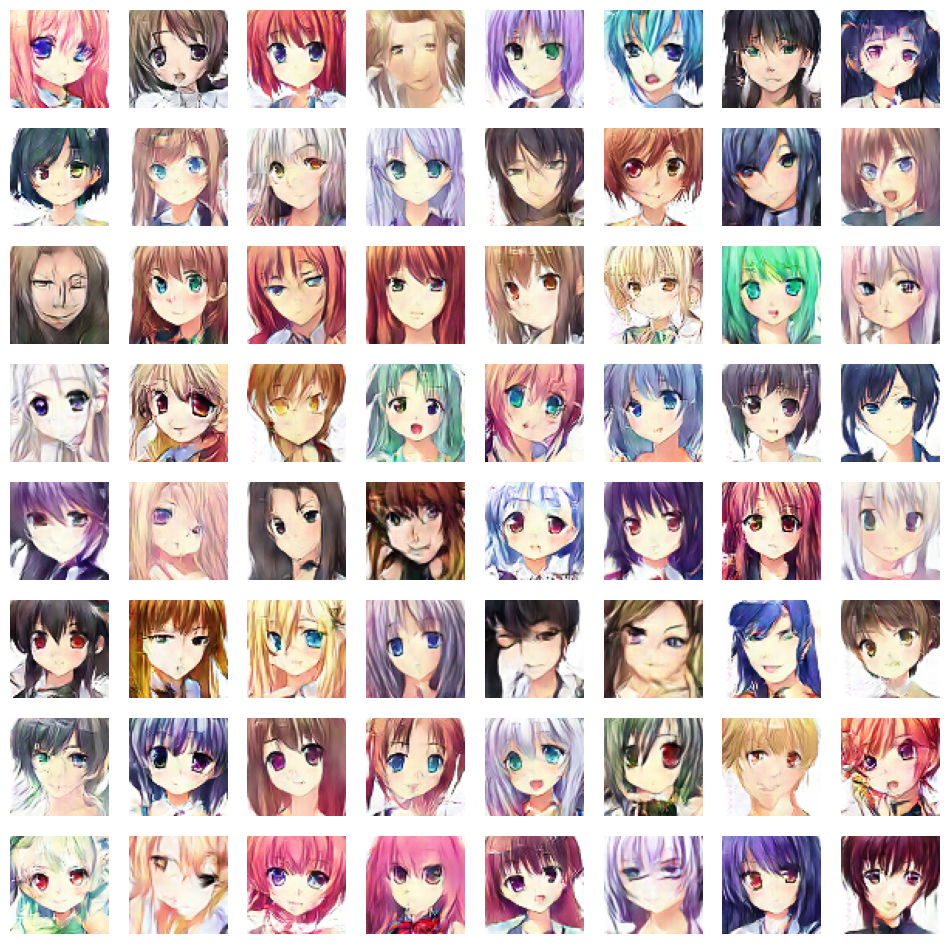

Este proyecto se centra en utilizar una Deep Convolutional Generative Adversarial Network (DCGAN), una arquitectura de red neuronal especialmente diseñada para la generación de imágenes realistas. La elección de una DCGAN se debe a su capacidad para capturar las características de alta resolución y las estructuras de las imágenes, lo que la hace ideal para la generación de caras de anime detalladas y convincentes.

## Conjunto de datos
Este es un conjunto de datos que consta de 21551 caras de anime extraídas de www.getchu.com, que luego se recortan utilizando el algoritmo de detección de caras de anime en https://github.com/nagadomi/lbpcascade_animeface. Todas las imágenes se cambiaron a un tamaño de 64 * 64 por conveniencia. Este dataset está disponible en [Kaggle](https://www.kaggle.com/datasets/soumikrakshit/anime-faces)

## Referencias

- [Página oficial del conjunto de datos CelebA](https://keras.io/examples/generative/dcgan_overriding_train_step/)
